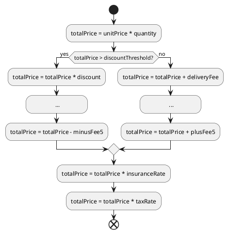
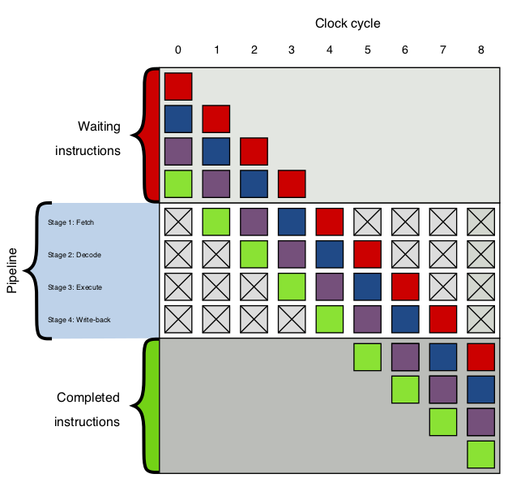
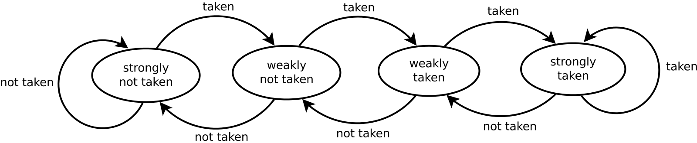
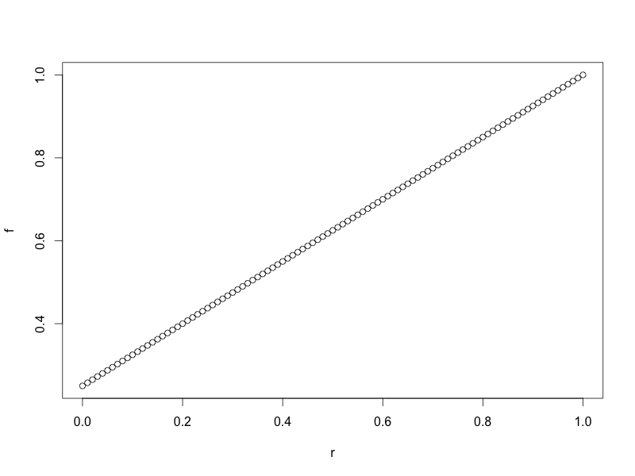
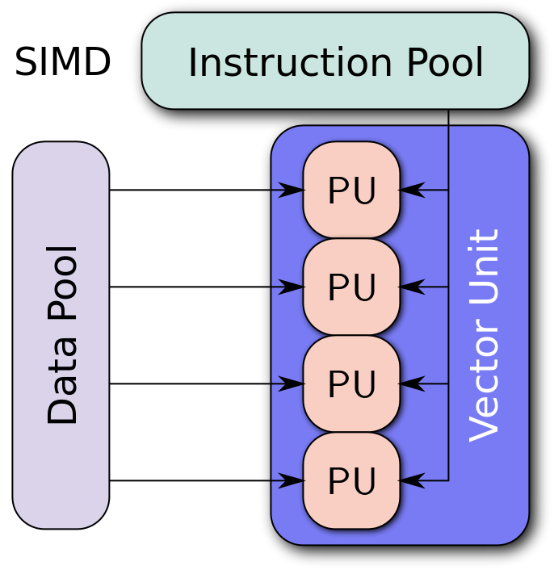

<!-- slide -->
# Control Execution

**Java: from entry to abandon**

> by Ray Cai
> July 9, 2017

<!-- slide -->
## Objectives

1. Understood conditional control
2. Understood iteration control
3. Abandoned Java

<!-- slide -->
## Conditional Control

<!-- slide -->
## Quick Example

**Problem**
1. Total price is the product of unit price and quantity
2. If total price is greater than $99.00, then it can get 2% discount, free delivery service, and minus several fees;
3. If total price is not greater than $99.00, then it cannot get any discount, or free delivery service. And plus several fees.

<!-- slide -->
## Solution
```java
public float calculateTotalPrice(final float unitPrice, final int quantity){
    final float discountThreshold = 99.0F;
    final float discount = 0.98F;
    final float deliveryFee = 5.0F;
    final float plusFee1 = 0.01F;
    final float plusFee2 = 0.02F;
    final float plusFee3 = 0.03F;
    final float plusFee4 = 0.04F;
    final float plusFee5 = 0.05F;
    final float minusFee1 = 0.001F;
    final float minusFee2 = 0.002F;
    final float minusFee3 = 0.003F;
    final float minusFee4 = 0.004F;
    final float minusFee5 = 0.005F;
    final float taxRate = 0.17F;
    final float insuranceRate = 0.05F;
    float totalPrice = unitPrice * quantity;
```

<!-- slide -->
## Solution
```java
    if(totalPrice > discountThreshold){
        totalPrice = totalPrice * discount;
        totalPrice = totalPrice - minusFee1;
        totalPrice = totalPrice - minusFee2;
        totalPrice = totalPrice - minusFee3;
        totalPrice = totalPrice - minusFee4;
        totalPrice = totalPrice - minusFee5
    }else{
        totalPrice = totalPrice + deliveryFee;
        totalPrice = totalPrice + plusFee1;
        totalPrice = totalPrice + plusFee2;
        totalPrice = totalPrice + plusFee3;
        totalPrice = totalPrice + plusFee4;
        totalPrice = totalPrice + plusFee5;
    }
    totalPrice = totalPrice * insuranceRate;
    totalPrice = totalPrice * taxRate;
    return totalPrice;
}
```

<!-- slide -->
## Logic View


<!-- slide -->
## Control Transfer in JVM
```javabyte
public calculateTotalPrice(FI)F
...
 L16
  LINENUMBER 24 L16
  FLOAD 18
  LDC 99.0
  FCMPL
  IFLE L17
 L18
  LINENUMBER 25 L18
  FLOAD 18
  LDC 0.98
  FMUL
  FSTORE 18
...
 L17
  LINENUMBER 33 L17
  FLOAD 18
  LDC 5.0
  FADD
  FSTORE 18
...
```
[Control Transfer Instructions](http://docs.oracle.com/javase/specs/jvms/se8/html/jvms-2.html#jvms-2.11.7)

<!-- slide -->
## Instrument Pipeline



[Branch predictor](https://en.wikipedia.org/wiki/Branch_predictor)

<!-- slide -->
## Execution time in Instrument Pipeline

Assume:

number of stage is $s$,
number of instrument is $n$
elapsed time of one stage is $t_s$,
elapsed time of one clock cycle is $t_c$.

and $ t_c = s * t_s $

Total elapsed time function $ f(s,t_c,n) $

$$
\begin{eqnarray}
f(s,t_c,n) &=& s * t_s + ( \frac{(n*s-\frac{s^2}{2}-\frac{s^2}{2})}{s} ) * t_s + s * t_s \\
&=& (n+s)*t_s \\
&=& (n+s)*\frac{t_c}{s} \\
&=& (\frac{n}{s}+1)*t_c
\end{eqnarray}
$$

<!-- slide -->
## Branch Prediction
```javabyte
public calculateTotalPrice(FI)F
...
 L16
  LINENUMBER 24 L16
  FLOAD 18
  LDC 99.0
  FCMPL
  IFLE L17
 L18
  LINENUMBER 25 L18
  FLOAD 18
  LDC 0.98
  FMUL
  FSTORE 18
...
 L17
  LINENUMBER 33 L17
  FLOAD 18
  LDC 5.0
  FADD
  FSTORE 18
...
```
<!-- slide -->
## Saturating Counter



[Branch predictor](https://en.wikipedia.org/wiki/Branch_predictor)

<!-- slide -->
## Branch Mispredict

Assume:

One instrument cost $t_s$ if branch prediction matched,
One instrument cost $t_c$ if branch prediction missed,
Given $n$ instruments, $n_{mis}$ instruments were branch mispredicted.
The miss ratio $r_{mis} = \frac{n_{mis}}{n}$

Then, total time cost $f(t_c,n,r_{mis})$

$$
\begin{eqnarray}
f(t_c,n,r_{mis}) &=& n_{mis}*t_c + (n-n_{mis})*t_s \\
&=& (r_{mis}*n+\frac{n*(1-r_{mis})}{s})*t_c
\end{eqnarray}
$$

<!-- slide -->
## Branch Mispredict Cost

```r
r <- seq(0,1,0.01)
f = r+(1-r)/4
plot(r,f)
```



<!-- slide -->
## Benchmark
```java
@Setup(Level.Trial)
public void init() {
    orderUtil = new OrderUtil();

    final int size = 1000;
    random = new Random();
    unorderedList=new ArrayList<>(size);


    for (int i = 1; i <= size; i++) {
        int randomNumber = random.nextInt() % 100;
        unorderedList.add((float)randomNumber);
    }

    orderedList = new ArrayList<>(unorderedList);
    Collections.sort(orderedList);
}
```

<!-- slide -->
## Benchmark
```java
@Benchmark
public void inputOrdered() {
    for(Float input:orderedList){
        orderUtil.calculateTotalPrice(input,2);
    }
}

@Benchmark
public void inputUnordered() {
    for(Float input:unorderedList){
        orderUtil.calculateTotalPrice(input,2);
    }
}
```

[Code Tools: jmh](http://openjdk.java.net/projects/code-tools/jmh/)

<!-- slide -->
## Benchmark Result
```
# JMH version: 1.19
# VM version: JDK 1.8.0_40, VM 25.40-b25
# VM invoker: /Library/Java/JavaVirtualMachines/jdk1.8.0_40.jdk/Contents/Home/jre/bin/java
# VM options: <none>
# Warmup: 20 iterations, 1 s each
# Measurement: 10 iterations, 1 s each
# Timeout: 10 min per iteration
# Threads: 1 thread, will synchronize iterations
# Benchmark mode: Throughput, ops/time
```
Benchmark       |Mode  |Cnt        |Score       |Avg  |Units|
----------------|------|-----------|------------|-----|-----|
inputOrdered    |thrpt |100  |1628167.316 ± |27474.121  |ops/s|
inputUnordered  |thrpt |100  |1653527.807 ±  |8269.157  |ops/s|

<!-- slide -->
## Iteration


<!-- slide -->
## Quick Example

**Problem**
Summary a sequence of integers

<!-- slide -->
## Solution

```java
public void sequentialSum(){
  int sum =0;
  for(int i=0;i<input.length;i++){
    sum = sum + input[i];
  }
}
```

<!-- slide -->
## Branch in Iteration
```javabyte
public sequentialSum()V
 @Lorg/openjdk/jmh/annotations/Benchmark;()
...
  L2
  FRAME APPEND [I I]
   ILOAD 2
   ALOAD 0
   GETFIELD me/raycai/java101/lecture03/VectorizationBenchmark.input : [I
   ARRAYLENGTH
   IF_ICMPGE L3
```

<!-- slide -->
## Branch in iteration
```
public unrollingSum()V
  @Lorg/openjdk/jmh/annotations/Benchmark;()
...
   L3
   FRAME APPEND [I I I]
    ILOAD 3
    ALOAD 0
    GETFIELD me/raycai/java101/lecture03/VectorizationBenchmark.input : [I
    ARRAYLENGTH
    IF_ICMPGE L4
```
[Control Transfer Instructions](http://docs.oracle.com/javase/specs/jvms/se8/html/jvms-2.html#jvms-2.11.7)

<!-- slide -->
## Branch Mispredict Cost

$$
\begin{eqnarray}
f(t_c,n,r_{mis}) &=& n_{mis}*t_c + (n-n_{mis})*t_s \\
&=& (r_{mis}*n+\frac{n*(1-r_{mis})}{s})*t_c
\end{eqnarray}
$$

<!-- slide -->
## Loop unrolling
```java
public void unrollingSum(){
  final int unrollingBatch = 4;
  int sum = 0;
  for(int i=0;i<input.length;i+=unrollingBatch){
    sum = sum + input[i];
    sum = sum + input[i+1];
    sum = sum + input[i+2];
    sum = sum + input[i+3];
  }
}
```

<!-- slide -->
## Benchmark

Benchmark      |Mode  |Cnt          |Score          |Avg  |Units
---------------|------|-------------|---------------|-----|-----
sequentialSum  |thrpt  |100  |842805534.817 ± |21546703.222  |ops/s
unrollingSum   |thrpt  |100  |508509630.488 ± |10583439.034  |ops/s

<!-- slide -->
## JIT and Optimization

**For iteration:**

* Loop unrolling
* Auto-Vectorization

[What the JIT!? Anatomy of the OpenJDK HotSpot VM](https://www.infoq.com/articles/OpenJDK-HotSpot-What-the-JIT)

<!-- slide -->
## Loop unrolling

```java
for(int i=0;i<input.length;i++){
  sum = sum + input[i];
}
```
After unrolling:
```java
for(int i=0;i<input.length;i+=4){
  sum = sum + input[i];
  sum = sum + input[i+1];
  sum = sum + input[i+2];
  sum = sum + input[i+3];
}
```

<!-- slide -->
## Auto Vectorization
**Why vectorization?**
> almost modern CPUs support vector operations

* IBM's AltiVec and SPE for PowerPC,
* HP's PA-RISC Multimedia Acceleration eXtensions (MAX),
* Intel's MMX and iwMMXt, SSE, SSE2, SSE3 SSSE3 and SSE4.x,
* AMD's 3DNow!,
* ARC's ARC Video subsystem,
* SPARC's VIS and VIS2,
* Sun's MAJC,
* ARM's NEON technology,
* MIPS' MDMX (MaDMaX) and MIPS-3D

<!-- slide -->
## Single instruction, multiple data (SIMD)



<!-- slide -->
## How HotSpot JVM Auto-Vectorization

1. Assembly stubs for counted inner loops;
2. SuperWord Level Parallelism (SLP) support for auto-Vectorization.

<!-- slide -->
## SuperWord Level Parallelism (SLP)
```java
for (i=0; i<16; i++) {
localdiff = ref[i] - curr[i];
diff += abs(localdiff);
}
```
(a) Original loop.
```java
for (i=0; i<16; i++) {
T[i] = ref[i] - curr[i];
}
for (i=0; i<16; i++) {
diff += abs(T[i]);
}
```
(b) After scalar expansion and loop fission.
<!-- slide -->
## SuperWord Level Parallelism (SLP)
```java
for (i=0; i<16; i+=4) {
localdiff = ref[i+0] - curr[i+0];
diff += abs(localdiff);
localdiff = ref[i+1] - curr[i+1];
diff += abs(localdiff);
localdiff = ref[i+2] - curr[i+2];
diff += abs(localdiff);
localdiff = ref[i+3] - curr[i+3];
diff += abs(localdiff);
}
```
(c) Superword level parallelism exposed after unrolling.

<!-- slide -->
## SuperWord Level Parallelism (SLP)
```java
for (i=0; i<16; i+=4) {
localdiff0 = ref[i+0] - curr[i+0];
localdiff1 = ref[i+1] - curr[i+1];
localdiff2 = ref[i+2] - curr[i+2];
localdiff3 = ref[i+3] - curr[i+3];
diff += abs(localdiff0);
diff += abs(localdiff1);
diff += abs(localdiff2);
diff += abs(localdiff3);
}
```
(d) Packable statements grouped together after renaming.

[Exploiting Superword Level Parallelism
with Multimedia Instruction Sets](http://groups.csail.mit.edu/cag/slp/SLP-PLDI-2000.pdf)

<!-- slide -->
## Appendix

1.[Building hsdis-amd64.dylib on Mac OSX](https://www.chrisnewland.com/building-hsdis-amd64dylib-on-mac-osx-376)
```
wget http://www.java.net/download/openjdk/jdk8/promoted/b132/openjdk-8-src-b132-03_mar_2014.zip
unzip openjdk-8-src-b132-03_mar_2014.zip
cd openjdk/hotspot/src/share/tools/hsdis
wget http://ftp.heanet.ie/mirrors/gnu/binutils/binutils-2.24.tar.gz
tar -xzf binutils-2.24.tar.gz
make BINUTILS=binutils-2.24 ARCH=amd64
sudo cp build/macosx-amd64/hsdis-amd64.dylib /Library/Java/JavaVirtualMachines/jdk1.8.0_05.jdk/Contents/Home/jre/lib/server/
```

<!-- slide -->
## Reading

1. [The Java Language Specification, Java SE 8 Edition](https://docs.oracle.com/javase/specs/jls/se8/jls8.pdf)
2. [The Java Virtual Machine Specification, Java SE 8 Edition](https://docs.oracle.com/javase/specs/jvms/se8/jvms8.pdf)
3. [Introduction to the Theory of Computation, Third Edition, Michael Sipser, June 27, 2012]
4. [Exploiting Superword Level Parallelism
with Multimedia Instruction Sets, Samuel Larsen and Saman Amarasinghe
MIT Laboratory for Computer Science
Cambridge, MA 02139
{slarsen,saman}@lcs.mit.edu](http://groups.csail.mit.edu/cag/slp/SLP-PLDI-2000.pdf)
