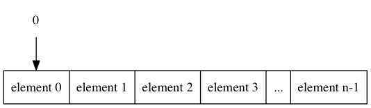
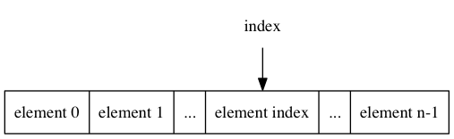

## The Road to Java

### Lecture 10: Holding Your Objects

> by **Ray Cai**

> Mar 26th, 2017

---

## Agenda

* Architecture of Java Collections Framework
* List
* Map
* Set

---

## Architecture of Java Collections Framework

---

## What is a Collections Framework

A collections framework is a unified architecture for representing and manipulating collections. All collections frameworks contain the following:

* **Interfaces:** These are abstract data types that represent collections. Interfaces allow collections to be manipulated independently of the details of their representation. In object-oriented languages, interfaces generally form a hierarchy.
* **Implementations:** These are the concrete implementations of the collection interfaces. In essence, they are reusable data structures.
* **Algorithms:** These are the methods that perform useful computations, such as searching and sorting, on objects that implement collection interfaces. The algorithms are said to be polymorphic: that is, the same method can be used on many different implementations of the appropriate collection interface. In essence, algorithms are reusable functionality.

---

## Interfaces

```@plantuml
@startuml
class Collection << (I,mistyrose) >> {

}

class Set << (I,mistyrose) >> {

}

class List << (I,mistyrose) >> {

}
class Queue << (I,mistyrose) >> {

}
class Deque << (I,mistyrose) >> {

}
class SortedSet << (I,mistyrose) >> {

}

class Map << (I,mistyrose) >> {

}

class SortedMap << (I,mistyrose) >> {

}

Collection <|-- Set
Collection <|-- List
Collection <|-- Queue
Collection <|-- Deque

Set <|-- SortedSet

Map <|-- SortedMap

@enduml
```

---

## List

```@plantuml
@startuml

class List<E> << (I,mistyrose) >> {
  +add(): boolean
  +add(index: int, element: E)
  +addAll(c: Collection<? extends E>): boolean
  +addAll(index: int, c: Collection<? extends E>):boolean
  +clear()
  +contains(Object o): boolean
  +containsAll(c: Collection<?>): boolean
  +equals(o: Object): boolean
  +get(index: int): E
  +hashCode(): int
  +indexOf(o: Object): int
  +isEmpty(): boolean
  +iterator(): Iterator<E>
  +lastIndexOf(o: Object): int
  +listIterator(): ListIterator<E>
  +listIterator(index: int): ListIterator<E>
  +remove(index: int): E
  +remove(o: Object): boolean
  +removeAll(c: Collection<?>): boolean
  +retainAll(c: Collection<?>): boolean
  +set(index: int, element: E): E
  +size(): int
  +subList(fromIndex: int, toIndex: int): List<E>
  +toArray(): Object[]
  +toArray(a: T[]):T[]
}
class ArrayList<E> <<implementation>> {

}

class LinkedList<E> <<implementation>> {

}

List <|-- ArrayList
List <|-- LinkedList
@enduml
```

---

## Data Structure of ArrayList



---

## Complexity of ArrayList

| Method                      | Average               | Worst Case        |
|-----------------------------|------------------------|------------------|
| Space                       | **?**                  |   **?**          |
| get(index: int)             | **?**                  |   **?**          |
| add(index: int, element: E) | **?**                  |   **?**          |
| remove(index: int)          | **?**                  |   **?**          |

---

## get(index: int)



```java
public E get(int index) {
    rangeCheck(index);

    return elementData(index);
}
```

---

## add(index: int, element: E)

```java
public void add(int index, E element) {
    rangeCheckForAdd(index);

    ensureCapacityInternal(size + 1);  // Increments modCount!!
    System.arraycopy(elementData, index, elementData, index + 1,
                     size - index);
    elementData[index] = element;
    size++;
}
```

---

## remove(index)

```java
public E remove(int index) {
    rangeCheck(index);

    modCount++;
    E oldValue = elementData(index);

    int numMoved = size - index - 1;
    if (numMoved > 0)
        System.arraycopy(elementData, index+1, elementData, index,
                         numMoved);
    elementData[--size] = null; // clear to let GC do its work

    return oldValue;
}
```

## Complexity of ArrayList

| Method                      | Average             | Worst Case |
|-----------------------------|---------------------|---------------|
| Space                       | $\mathcal{O}(n)$    | $\mathcal{O}(n)$|
| get(index: int)             | $\mathcal{O}(1)$    | $\mathcal{O}(1)$ |
| add(index: int, element: E) | $\mathcal{O}(n)$    | $\mathcal{O}(n)$ |
| remove(index: int)          | $\mathcal{O}(n)$    | $\mathcal{O}(n)$ |

---

## Data Structure of LinkedList

```@viz
engine:dot
digraph LinkedList {
  rankdir=LR;

  a -> b -> c -> d -> e -> f;
  f -> e -> d -> c -> b -> a;

  head [shape=plaintext]
  tail [shape=plaintext]

  head -> a [style=dashed]
  tail -> f [style=dashed]
}
```

---

## Complexity of LinkedList

| Method                      | Average                | Worst Case |
|-----------------------------|------------------------|-------------------|
| Space                       | **?**                  |   **?**          |
| get(index: int)             | **?**                  |   **?**          |
| add(index: int, element: E) | **?**                  |   **?**          |
| remove(index: int)          | **?**                  |   **?**          |

---

## get(index: int)

```java
public E get(int index) {
    checkElementIndex(index);
    return node(index).item;
}
Node<E> node(int index) {
    // assert isElementIndex(index);

    if (index < (size >> 1)) {
        Node<E> x = first;
        for (int i = 0; i < index; i++)
            x = x.next;
        return x;
    } else {
        Node<E> x = last;
        for (int i = size - 1; i > index; i--)
            x = x.prev;
        return x;
    }
}
```

---

## add(index: int, element: E)

```java
public void add(int index, E element) {
    checkPositionIndex(index);

    if (index == size)
        linkLast(element);
    else
        linkBefore(element, node(index));
}
void linkBefore(E e, Node<E> succ) {
    // assert succ != null;
    final Node<E> pred = succ.prev;
    final Node<E> newNode = new Node<>(pred, e, succ);
    succ.prev = newNode;
    if (pred == null)
        first = newNode;
    else
        pred.next = newNode;
    size++;
    modCount++;
}
```

## remove(index: int)

```java
public E remove(int index) {
    checkElementIndex(index);
    return unlink(node(index));
}
E unlink(Node<E> x) {
    // assert x != null;
    final E element = x.item;
    final Node<E> next = x.next;
    final Node<E> prev = x.prev;

    if (prev == null) {
        first = next;
    } else {
        prev.next = next;
        x.prev = null;
    }

    if (next == null) {
        last = prev;
    } else {
        next.prev = prev;
        x.next = null;
    }

    x.item = null;
    size--;
    modCount++;
    return element;
}
```

## Complexity of LinkedList

| Method                      | Average          | Worst Case |
|-----------------------------|------------------|-----------------|
| Space                       | $\mathcal{O}(n)$ | $\mathcal{O}(n)$|
| get(index: int)             | $\mathcal{O}(n)$ | $\mathcal{O}(n)$|
| add(index: int, element: E) | $\mathcal{O}(n)$ | $\mathcal{O}(n)$|
| remove(index: int)          | $\mathcal{O}(n)$ | $\mathcal{O}(n)$|

---

## Map

```@plantuml
@startuml
class Map<K,V> << (I,mistyrose) >> {
  +clear()
  +containsKey(key: Object): boolean
  +containsValue(value: Object): boolean
  +entrySet(): Set<Map.Entry<K,V>>
  +equals(o: Object): boolean
  +get(key: Object): V
  +hashCode(): int
  +isEmpty(): boolean
  +keySet(): Set<K>
  +put(key: K, value: V): V
  +putAll(m: Map<? extends K, ? extends V>)
  +remove(key: Object): V
  +size(): int
  +values(): Collection<V>
}
class HashMap <<implementation>> {

}
class TreeMap <<implementation>> {

}
Map <|-- HashMap
Map <|-- TreeMap
@enduml
```

---

## Data Structure of HashMap

```@viz
engine:dot
digraph HashMap {
  hashtable [shape=record, label="<b0> 0|<b1> 1|<b2> 2|<b3> 3|<b4> 4|<b5> 5|<b6> 6|<bx> ..."]

  b00 -> b01 -> b02
  b10 -> b11
  b20 -> b21 -> b22 -> b23 -> b24 -> b25
  b30 -> b31 -> b32 -> b33 -> b34
  b40 -> b41 -> b42 -> b43

  hashtable:b0 -> b00:n
  hashtable:b1 -> b10:n
  hashtable:b2 -> b20:n
  hashtable:b3 -> b30:n
  hashtable:b4 -> b40:n

}
```

## Complexity of HashMap

| Method                      | Average         | Worst Case       |
|-----------------------------|-----------------|------------------|
| Space                       | **?**          |   **?**          |
| put(key: K, value: V)       | **?**          |   **?**          |
| get(key: K)                 | **?**           |   **?**          |

---

## put(key: K, value: V)

```java
final V putVal(int hash, K key, V value, boolean onlyIfAbsent,
               boolean evict) {
    Node<K,V>[] tab; Node<K,V> p; int n, i;
    if ((tab = table) == null || (n = tab.length) == 0)
        n = (tab = resize()).length;
    if ((p = tab[i = (n - 1) & hash]) == null)
        tab[i] = newNode(hash, key, value, null);
    else {
        Node<K,V> e; K k;
        if (p.hash == hash &&
            ((k = p.key) == key || (key != null && key.equals(k))))
            e = p;
        else if (p instanceof TreeNode)
            e = ((TreeNode<K,V>)p).putTreeVal(this, tab, hash, key, value);
        else {
            for (int binCount = 0; ; ++binCount) {
                if ((e = p.next) == null) {
                    p.next = newNode(hash, key, value, null);
                    if (binCount >= TREEIFY_THRESHOLD - 1) // -1 for 1st
                        treeifyBin(tab, hash);
                    break;
                }
                if (e.hash == hash &&
                    ((k = e.key) == key || (key != null && key.equals(k))))
                    break;
                p = e;
            }
        }
        if (e != null) { // existing mapping for key
            V oldValue = e.value;
            if (!onlyIfAbsent || oldValue == null)
                e.value = value;
            afterNodeAccess(e);
            return oldValue;
        }
    }
    ++modCount;
    if (++size > threshold)
        resize();
    afterNodeInsertion(evict);
    return null;
}
```

## get(key: K)

```java
final Node<K,V> getNode(int hash, Object key) {
    Node<K,V>[] tab; Node<K,V> first, e; int n; K k;
    if ((tab = table) != null && (n = tab.length) > 0 &&
        (first = tab[(n - 1) & hash]) != null) {
        if (first.hash == hash && // always check first node
            ((k = first.key) == key || (key != null && key.equals(k))))
            return first;
        if ((e = first.next) != null) {
            if (first instanceof TreeNode)
                return ((TreeNode<K,V>)first).getTreeNode(hash, key);
            do {
                if (e.hash == hash &&
                    ((k = e.key) == key || (key != null && key.equals(k))))
                    return e;
            } while ((e = e.next) != null);
        }
    }
    return null;
}
```

---

## Complexity of HashMap

| Method                      | Average         | Worst Case       |
|-----------------------------|-----------------|------------------|
| Space                       | $\mathcal{O}(n)$| $\mathcal{O}(n)$ |
| put(key: K, value: V)       | $\mathcal{O}(1)$| $\mathcal{O}(n)$ |
| get(key: K)                 | $\mathcal{O}(1)$| $\mathcal{O}(n)$ |

---

## Binary Search Tree

```@viz
engine:dot
digraph tree {
  8 -> 3
  8 -> 10
  3 -> 1
  3 -> 6
  6 -> 4
  6 -> 7
  10 -> 14
  14 -> 13
}
```

---

## Complexity of Binary Search Tree

| Algorithm | Average                | Worst Case|
|-----------|------------------------|-----------|
| Space     |$\mathcal{O}(n)$        |$\mathcal{O}(n)$ |
| Search    |$\mathcal{O}(\log{}n)$ |$\mathcal{O}(n)$ |
| Insert    |$\mathcal{O}(\log{}n)$ |$\mathcal{O}(n)$ |
| Delete    |$\mathcal{O}(\log{}n)$ |$\mathcal{O}(n)$ |

---

## Full Balanced Binary Search Tree

```@viz
engine:dot
digraph tree {
  7 -> 4
  4 -> 3
  4 -> 6
  3 -> 1
  7 -> 13
  13 -> 10
  10 -> 8
  13 -> 14
}
```

---

## Tree Rotation


---

## Complexity of Full Balanced Binary Search Tree

| Algorithm | Average                | Worst Case|
|-----------|------------------------|-----------|
| Space     |$\mathcal{O}(n)$        |$\mathcal{O}(n)$ |
| Search    |$\mathcal{O}(\log{}n)$ |$\mathcal{O}(\log{}n)$ |
| Insert    |$\mathcal{O}(\log{}n)$ |$\mathcal{O}(\log{}n)$ |
| Delete    |$\mathcal{O}(\log{}n)$ |$\mathcal{O}(\log{}n)$ |

---

## Red Black Tree

```@viz
engine:dot
digraph tree {
  node [style=filled,fontcolor=white]

  1 [color=black]
  6 [color=red]
  8 [color=red]
  11 [color=black]
  13 [color=black]
  15 [color=black]
  17 [color=red]
  22 [color=red]
  25 [color=black]
  27 [color=red]

  1 -> 6
  8 -> 1
  8 -> 11
  13 -> 8
  13 -> 17
  17 -> 15
  17 -> 25
  25 -> 22
  25 -> 27

}
```

---

## Red Black Tree - Properties

1. Each node is either red or black.
2. The root is black. This rule is sometimes omitted. Since the root can always be changed from red to black, but not necessarily vice versa, this rule has little effect on analysis.
3. All leaves (NIL) are black.
4. If a node is red, then both its children are black.
5. Every path from a given node to any of its descendant NIL nodes contains the same number of black nodes. Some definitions: the number of black nodes from the root to a node is the node's black depth; the uniform number of black nodes in all paths from root to the leaves is called the black-height of the red–black tree.

---

## Complexity of Red Black Tree

| Algorithm | Average                | Worst Case|
|-----------|------------------------|-----------|
| Space     |$\mathcal{O}(n)$        |$\mathcal{O}(n)$ |
| Search    |$\mathcal{O}(\log{}n)$ |$\mathcal{O}(\log{}n)$ |
| Insert    |$\mathcal{O}(\log{}n)$ |$\mathcal{O}(\log{}n)$ |
| Delete    |$\mathcal{O}(\log{}n)$ |$\mathcal{O}(\log{}n)$ |

-----

## Set

```@plantuml
@startuml
class Set<E> << (I,mistyrose) >> {
  +add(e: E): boolean
  +addAll(c: Collection<? extends E>): boolean
  +clear()
  +contains(o: Object): boolean
  +containsAll(c: Collection<?>): boolean
  +equals(o: Object): boolean
  +hashCode(): int
  +isEmpty(): boolean
  +iterator(): Iterator<E>
  +remove(o: Object): boolean
  +removeAll(c: Collection<?>): boolean
  +retainAll(c: Collection<?>): boolean
  +size(): int
  +toArray(): Object[]
  +toArray<T>(a: T[]): T[]
}

class HashSet <<implementation>> {

}
class TreeSet <<implementation>> {

}
Set <|-- HashSet
Set <|-- TreeSet
@enduml
```

## Reference

* [Lesson: Introduction to Collections](http://docs.oracle.com/javase/tutorial/collections/intro/index.html)
* [Red-Black Tree](https://en.wikipedia.org/wiki/Red%E2%80%93black_tree)
* [Binary Search Tree](https://en.wikipedia.org/wiki/Binary_search_tree)
* [Tree Rotation](https://en.wikipedia.org/wiki/Tree_rotation)
* [Self-Balancing Binary Search Tree](https://en.wikipedia.org/wiki/Self-balancing_binary_search_tree)
