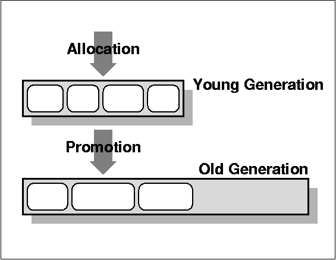
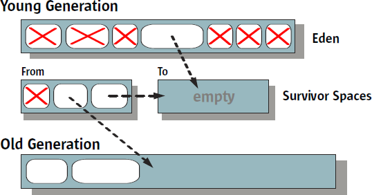
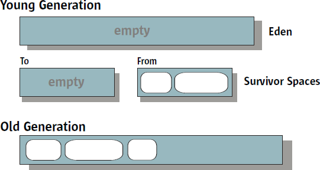
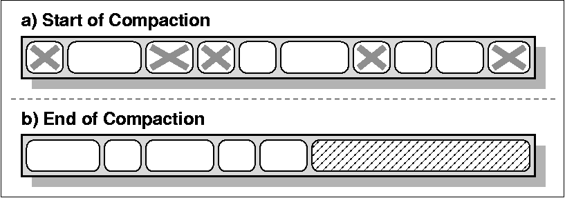
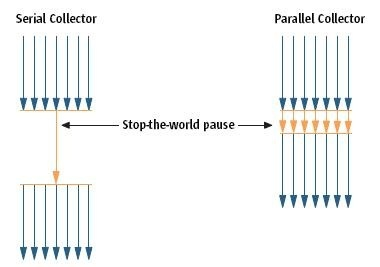

# Memory Management in Java HotSpot Virtual Machine

## Garbage Collection Concepts

A garbage collector is responsible for

* allocating memory
* ensuring that any referenced objects remain in memory, and
* recovering memory used by objects that are no longer reachable from references in executing code

---

## Design Choices

* Serial versus Parallel
* Concurrent versus Stop-the-world
* Compacting versus Non-compacting versus Copying

---

## Performance Metrics

* Throughput
* Garbage collection overhead
* Pause time
* Frequency of collection
* Footprint
* Promptness

---

## Generational Collection

---

## Garbage Collectors in J2SE 5.0 HotSpot JVM

---

## HotSpot Generations

---

## Garbage Collection Types

* Fast Allocation
* Serial Collector
* Parallel Collector
* Parallel Compacting Collector
* Concurrent Mark-Sweep (CMS) Collector
* Garbage-First (G1) Collector

---

## Serial Collector

* both young and old collections are done serially
* stop-the-world

---

## Young Generation Collection Using the Serial Collector

---

## Young Generation Collection Using the Serial Collector

---

## Old Generation Collection Using the Serial Collector

*old and permanent generations are collected via a mark-sweep-compact collection algorithm*

---

## When to Use the Serial Collector

* client-style machines
* do not have a requirement for low pause time
* heap size withing 64MB

*Serial Collector Selection*

>-XX:+UseSerialGC

---

## Parallel Collector

suitable for machines which:

* with a lot of physical memory
* with multiple CPUs

---

## Young Generation Collection Using the Parallel Collector

* uses a parallel version of the young generation collection algorithm
* still stop-the-world

---

## Old Generation Collection Using the Parallel Collector

Old generation garbage collection for the parallel collector is done using the same serial mark-sweepcompact
collection algorithm as the serial collector.

---

## When to Use the Parallel Collector

* run a machine with more than one CPU
* do not have pause time constraints

*Parallel Collector Selection*
>-XX:+UseParallelGC

---

## Parallel Compacting Collector

* since J2SE 5.0 update 6
* a new algorithm for old generation garbage collection

---

## Young Generation Collection Using the Parallel Compacting Collector

Young generation garbage collection for the parallel compacting collector is done using the same
algorithm as that for young generation collection using the parallel collector.

---

## Old Generation Collection Using the Parallel Compacting Collector

---

## When to Use the Parallel Compacting Collector

*Parallel Compacting Collector Selection*
> -XX:+UseParallelOldGC

---

## Concurrent Mark-Sweep (CMS) Collector

* low latency
* non-compacting

*Young Generation Collection Using the CMS Collector*

The CMS collector collects the young generation in the same manner as the parallel collector. 

---

## Old Generation Collection Using the CMS Collector

---

## When to Use the CMS Collector

* need shorter garbage collection pause
* have a large set of long-lived data
* run a machine with more than one CPU

*CMS Collector Selection*
>-XX:+UseConcMarkSweepGC.
>-XX:+CMSIncrementalMode

---

## Garbage-First (G1) Collector

* since Oracle JDK 7 update 4
* server-style garbage collector, targeted multi-processor and large memories
* heap is partitioned into a set of equal-sized heap regions
* G1 performs a concurrent global marking phase to determine the liveness of objects throughout the heap
* collect mostly empty region firstly

---

## Recommended Use Cases for G1

* require large heaps (6GB or larger) with limited GC latency (below 0.5 seconds)
* G1 is planned as the long term replacement for the Concurrent Mark-Sweep Collector (CMS)

>-XX:+UseG1GC

---

## Ergonomics

*Automatic Selections and Behavior Tuning*

>The combination of platform-dependent
 default selections and garbage collection tuning that uses desired behavior

* since J2SE 5.0
* Automatic Selection of Collector, Heap Sizes, and Virtual Machine
* Behavior-based Parallel Collector Tuning

---

## Behavior-based Parallel Collector Tuning

Maximum Pause Time Goal
>-XX:MaxGCPauseMillis=n

Throughput Goal
>-XX:GCTimeRatio=n

Footprint Goal

Goal Priorities

---

## References

* Memory Management in the Java HotSpot Virtual Machine, [http://www.oracle.com/technetwork/java/javase/tech/memorymanagement-whitepaper-1-150020.pdf](http://www.oracle.com/technetwork/java/javase/tech/memorymanagement-whitepaper-1-150020.pdf)
* Garbage Collector Ergonomics, [http://docs.oracle.com/javase/1.5.0/docs/guide/vm/gc-ergonomics.html](http://docs.oracle.com/javase/1.5.0/docs/guide/vm/gc-ergonomics.html)
* Java SE 6 HotSpot[tm] Virtual Machine Garbage Collection Tuning, [http://www.oracle.com/technetwork/java/javase/gc-tuning-6-140523.html](http://www.oracle.com/technetwork/java/javase/gc-tuning-6-140523.html)
* The Garbage-First Garbage Collector, [http://www.oracle.com/technetwork/java/javase/tech/g1-intro-jsp-135488.html](http://www.oracle.com/technetwork/java/javase/tech/g1-intro-jsp-135488.html)
* Garbage First Garbage Collector Tuning, [http://www.oracle.com/technetwork/articles/java/g1gc-1984535.html](http://www.oracle.com/technetwork/articles/java/g1gc-1984535.html)
 
